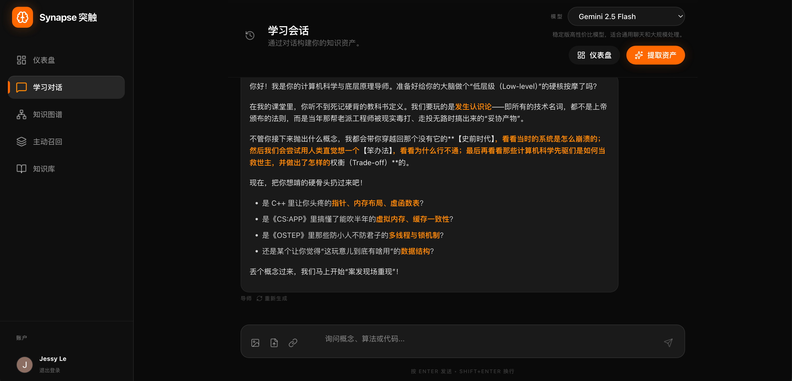
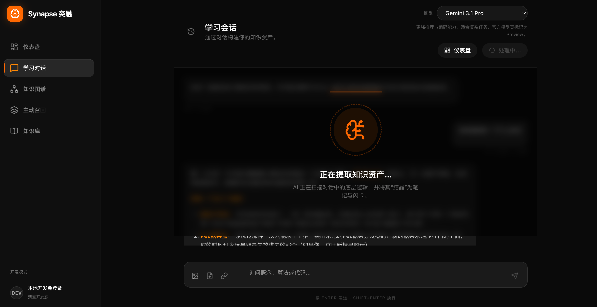
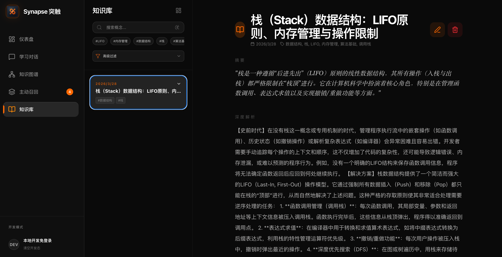
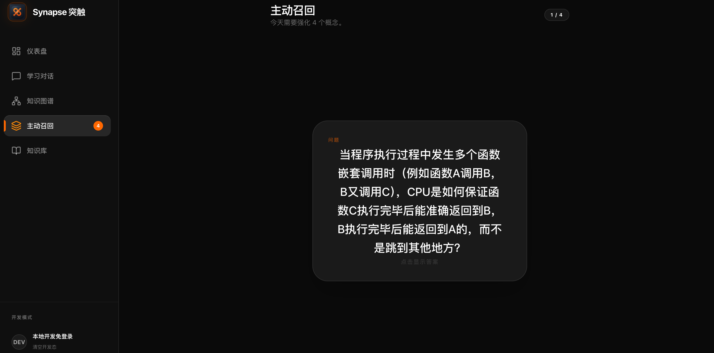
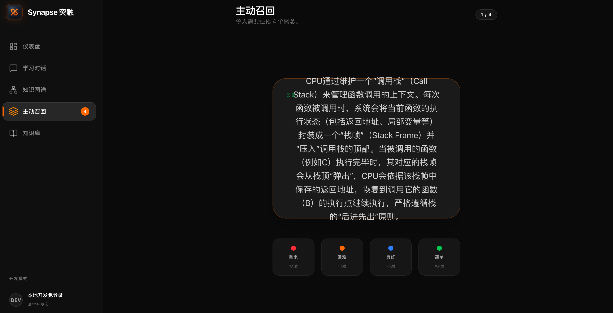
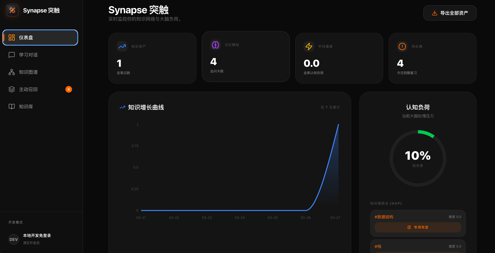
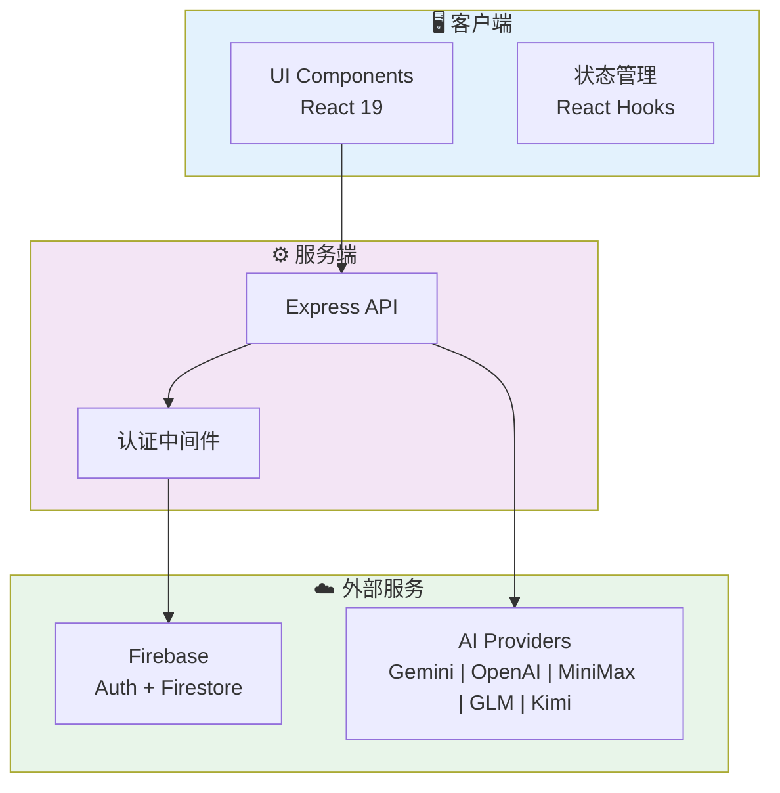
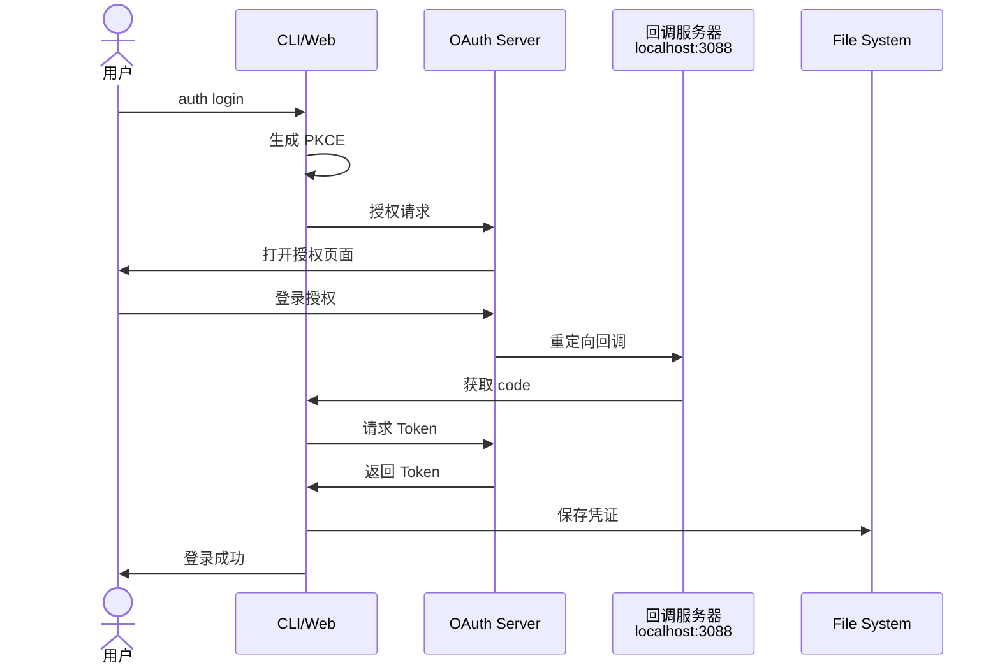
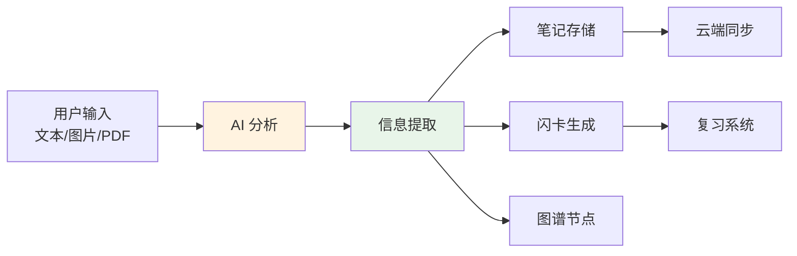

<div align="center">

# OpenSynapse (突触)

**🧠 AI 驱动的知识复利系统 | 智能学习笔记 | 间隔重复 | 知识图谱**

[](https://react.dev/)
[](https://www.typescriptlang.org/)
[](https://vitejs.dev/)
[](https://firebase.google.com/)
[](LICENSE)

<p align="center">
  <b>聊天 → 提炼 → 复习 → 连接</b><br/>
  <span style="color: #666;">AI 对话学习 + 智能笔记 + FSRS 复习 + 知识图谱可视化</span><br/>
  <span style="color: #666;">让知识积累成为复利增长</span>
</p>

[快速开始](#快速开始) • [功能特性](#功能特性) • [架构设计](#架构设计) • [贡献指南](#贡献指南) • [路线图](#路线图)

</div>

> 🎯 **OpenSynapse** 是一个开源的 AI 驱动知识管理系统，将 Gemini AI 对话、智能笔记提取、FSRS 间隔重复复习和 D3.js 知识图谱整合到一个工作流中。支持 Firebase 云端同步、多设备访问、OAuth 认证，以及 CLI 命令行工具。

---

---

## 📖 项目简介

OpenSynapse 是一个现代化的 AI 驱动知识管理系统，它将学习、记忆和知识连接整合到一个无缝的工作流中。灵感来源于神经元突触的形成机制——**通过反复刺激建立持久的知识连接**。

### 核心理念

> 知识的真正价值不在于收藏，而在于连接与提取。

传统笔记应用往往成为"知识的坟墓"——我们存储了大量信息却很少回顾。OpenSynapse 通过以下方式解决这个问题：

1. **主动学习** - AI 对话式学习，而非被动阅读
2. **智能提炼** - 自动提取结构化笔记和闪卡
3. **科学复习** - 基于 FSRS 间隔重复算法优化记忆
4. **可视化关联** - 知识图谱展示概念间的联系

---

## ✨ 功能特性

### 🤖 AI 学习会话
- **多导师人格系统** - 计算机、数学、法学、金融等专业导师，每种人格都有独特的教学风格和知识体系
- **LaTeX 数学公式渲染** - 支持数学、物理等学科公式完美显示（remark-math + rehype-katex）
- **流式对话** - 实时显示 AI 思考过程，支持停止生成和重新生成
- **多模态输入** - 支持文本、图片、PDF、URL 等多种输入方式
- **上下文感知** - 自动关联相关笔记和知识点
- **多模型支持** - Gemini、OpenAI、MiniMax、智谱、Moonshot 等多个 AI 提供商，支持模型切换与自动回退

### 📝 知识提炼
- **智能提取** - 从对话或文档中自动提取关键概念
- **结构化笔记** - 自动格式化 markdown 笔记
- **闪卡生成** - 一键生成 Anki 风格复习卡片
- **语义链接** - AI 自动识别并建议相关知识点连接

### 📥 对话导入
- **多格式支持** - JSON、Markdown、纯文本、Gemini网页导出格式一键导入
- **智能解析** - 自动检测格式，预览解析结果
- **去重提醒** - 检测重复会话，避免重复导入
- **双模式导入** - 仅导入会话，或导入并自动提炼知识

### 🔄 FSRS 复习系统
- **算法驱动** - 采用 Free Spaced Repetition Scheduler 算法
- **自适应调度** - 根据记忆曲线动态调整复习间隔
- **优先级排序** - 优先复习即将遗忘的内容
- **进度追踪** - 可视化学习进度和记忆保持率

### 🕸️ 知识图谱
- **交互式可视化** - 基于 D3.js 的力导向图
- **节点编辑** - 点击节点直接跳转编辑关联笔记
- **关系探索** - 发现知识点间的隐藏关联
- **性能优化** - 虚拟渲染支持大规模知识网络

### 🔐 多 AI 提供商支持
- **五家提供商** - Gemini、OpenAI、MiniMax、智谱 GLM、Moonshot Kimi
- **灵活认证** - OAuth 2.0、API Key、Gemini CLI / Code Assist 多种方式
- **模型回退** - 当首选模型不可用时自动切换到备用模型
- **统一接口** - 不同提供商的模型使用一致的调用接口

### 🎨 个性化体验
- **明暗主题切换** - 支持亮色/暗色模式，自动跟随系统偏好
- **多导师人格** - 根据学习场景切换不同专业导师
- **隐藏人格解锁** - 特殊交互解锁隐藏导师模式

### ☁️ 云端同步与多租户
- **多登录支持** - Google、微信、QQ 三种登录方式，完整数据隔离
- **账号绑定** - 一个账号可绑定多种登录方式，灵活切换
- **用户级 API Key** - 商业部署支持每个用户使用独立的 API Key
- **Firebase 集成** - Auth + Firestore 完整后端
- **实时同步** - 多设备间笔记、闪卡、会话实时同步
- **商业级隔离** - 每个用户的笔记、闪卡、对话、API Key 完全独立

### 💻 CLI 工具
- **命令行导入** - 从终端处理文本资料，支持多种格式
- **批量处理** - 支持批量导入和同步
- **多提供商支持** - CLI 同样支持切换不同 AI 提供商
- **脚本化** - 可集成到自动化工作流

---

## 📸 界面展示

<div align="center">

### 学习会话界面



*AI 驱动的学习会话，支持多轮对话和知识提取*

</div>

<div align="center">

### 知识图谱可视化



*交互式知识图谱，可视化展示概念间的关联关系*

</div>

<div align="center">

### 笔记管理与搜索



*强大的笔记管理功能，支持标签、日期筛选和全文搜索*

</div>

<div align="center">

### FSRS 复习系统


&nbsp;&nbsp;


*基于间隔重复算法的科学复习系统*

</div>

<div align="center">

### 仪表盘与数据概览



*个人学习数据中心，可视化展示学习进度和统计*

</div>

---

## 🚀 快速开始

### 环境要求

- **Node.js** 18+ 
- **npm** 9+ 或 **pnpm** 8+
- **Git**

### 安装步骤

```bash
# 克隆仓库
git clone https://github.com/JesstLe/OpenSynapse.git
cd OpenSynapse

# 安装依赖
npm install

# 启动开发服务器
npm run dev
```

访问 [http://localhost:3000](http://localhost:3000) 开始使用。

### 认证配置

#### 方式一：OAuth 登录（推荐）

```bash
# 一键登录，复用 Gemini CLI 凭证
npx tsx scripts/cli.ts auth login
```

登录后凭证保存至 `~/.opensynapse/credentials.json`，Web 和 CLI 共享登录态。

#### 方式二：API Key（多提供商）

```bash
# 复制环境变量模板
cp .env.example .env.local

# 编辑 .env.local，添加你想使用的提供商 API Key
# 支持以下任意组合：
GEMINI_API_KEY=your_gemini_key          # Google Gemini
OPENAI_API_KEY=your_openai_key          # OpenAI
MINIMAX_API_KEY=your_minimax_key        # MiniMax
ZHIPU_API_KEY=your_zhipu_key            # 智谱 GLM
MOONSHOT_API_KEY=your_moonshot_key      # Moonshot Kimi
```

配置完成后，在 Settings 页面或聊天界面切换模型即可使用对应的 AI 提供商。

---

## 🏗️ 架构设计

### 系统架构图

```
┌─────────────────────────────────────────────────────────────────┐
│                        Frontend Layer                           │
│  ┌──────────────┐  ┌──────────────┐  ┌──────────────────────┐  │
│  │  ChatView    │  │  ImportDialog│  │  NotesView          │  │
│  │  (学习会话)   │  │  (对话导入)   │  │  (笔记管理)          │  │
│  └──────────────┘  └──────────────┘  └──────────────────────┘  │
│  ┌──────────────┐  ┌──────────────┐  ┌──────────────────────┐  │
│  │  GraphView   │  │  ReviewView  │  │  SettingsView       │  │
│  │  (知识图谱)   │  │  (复习系统)   │  │  (设置中心)          │  │
│  └──────────────┘  └──────────────┘  └──────────────────────┘  │
│  ┌──────────────┐  ┌──────────────┐  ┌──────────────────────┐  │
│  │DashboardView │  │   Persona    │  │    Components       │  │
│  │  (仪表盘)     │  │  (人格系统)   │  │    (UI组件)          │  │
│  └──────────────┘  └──────────────┘  └──────────────────────┘  │
├─────────────────────────────────────────────────────────────────┤
│                        Service Layer                            │
│  ┌──────────────┐  ┌──────────────┐  ┌──────────────────────┐  │
│  │ AI Gateway   │  │    FSRS      │  │    Firebase         │  │
│  │ (多提供商)    │  │  (间隔重复)   │  │    (数据同步)        │  │
│  └──────────────┘  └──────────────┘  └──────────────────────┘  │
├─────────────────────────────────────────────────────────────────┤
│                        Library Layer                            │
│  ┌──────────────┐  ┌──────────────┐  ┌──────────────────────┐  │
│  │    OAuth     │  │  CodeAssist  │  │     AI Models       │  │
│  │  (认证库)     │  │  (API封装)    │  │   (模型管理)         │  │
│  └──────────────┘  └──────────────┘  └──────────────────────┘  │
├─────────────────────────────────────────────────────────────────┤
│                        API Layer                                │
│  ┌──────────────────────────────────────────────────────────┐  │
│  │              Express + Vite Dev Server                   │  │
│  │         /api/ai/*  |  /api/sync  |  Static Assets        │  │
│  └──────────────────────────────────────────────────────────┘  │
├─────────────────────────────────────────────────────────────────┤
│                      External Services                          │
│  ┌──────────────┐  ┌──────────────┐  ┌──────────────────────┐  │
│  │  Firebase    │  │   Gemini     │  │   Google Cloud      │  │
│  │  Auth/Store  │  │    API       │  │     OAuth           │  │
│  └──────────────┘  └──────────────┘  └──────────────────────┘  │
└─────────────────────────────────────────────────────────────────┘
```

### 核心模块

| 模块 | 职责 | 技术栈 |
|------|------|--------|
| **ChatView** | 学习会话 UI、模型切换、消息管理、流式对话 | React 19 + Motion |
| **PersonaSystem** | 多导师人格管理、系统提示词注入 | React + TypeScript |
| **ImportDialog** | 对话导入、格式解析、去重检测 | React + Motion |
| **SettingsView** | 提供商配置、人格管理、主题切换 | React + Tailwind |
| **GraphView** | 知识图谱可视化、D3 力导向图 | D3.js + Canvas |
| **NotesView** | 笔记 CRUD、搜索筛选、标签管理 | React + Tailwind |
| **ReviewView** | FSRS 复习界面、进度追踪 | React + Recharts |
| **AI Gateway** | 多提供商路由、协议适配、模型回退 | Express + Fetch API |
| **FSRS** | 间隔重复算法实现 | TypeScript |
| **OAuth** | PKCE 认证流程、Token 管理 | Node.js + Express |

### 数据流设计

```
User Input → Component → Service → API → External Service
                ↓           ↓        ↓
            State Update  Cache   Error Handler
                ↓           ↓        ↓
            Firebase ←  LocalStorage  →  Retry Logic
```

---

## 🛠️ 软件工程实践

### 1. 系统架构



### 2. 认证流程（OAuth 2.0 + PKCE）



### 3. 数据处理流



### 4. 开发规范

| 类别 | 规范 | 工具 |
|------|------|------|
| **代码风格** | TypeScript 严格模式 | `tsc --noEmit` |
| **提交规范** | Conventional Commits | git hooks |
| **分支管理** | Git Flow | Git |
| **错误处理** | try/catch + 统一格式 | ESLint |

### 5. 代码示例

**错误处理模式：**
```typescript
try {
  const result = await riskyOperation()
  return { success: true, data: result }
} catch (error) {
  return { 
    success: false, 
    error: error instanceof Error ? error.message : 'Unknown error' 
  }
}
```

**不可变更新：**
```typescript
// ✅ 正确
setNotes(prev => [...prev, newNote])

// ❌ 错误
notes.push(newNote)
```

---

## 📁 项目结构

```
OpenSynapse/
├── 📂 config/                  # 配置文件
│   └── firebase-applet-config.json
├── 📂 docs/                    # 文档
│   ├── screenshots/            # 界面截图
│   ├── auth/                   # 认证文档
│   └── features/               # 功能文档
├── 📂 scripts/                 # CLI 脚本
│   ├── cli.ts                  # 主 CLI
│   ├── cli-auth.ts             # 认证命令
│   └── test/                   # 测试脚本
├── 📂 src/
│   ├── 📂 api/                 # API 路由
│   │   ├── ai.ts               # AI 服务路由
│   │   └── auth.ts             # 认证路由 (WeChat/QQ OAuth)
│   ├── 📂 components/          # React 组件
│   │   ├── auth/               # 认证相关组件
│   │   │   ├── LoginSelection.tsx
│   │   │   └── AuthCallback.tsx
│   │   ├── ChatView.tsx
│   │   ├── DashboardView.tsx
│   │   ├── GraphView.tsx
│   │   ├── NotesView.tsx
│   │   └── ReviewView.tsx
│   ├── 📂 lib/                 # 工具库
│   │   ├── aiModels.ts         # AI 模型配置
│   │   ├── codeAssist.ts       # Code Assist 封装
│   │   ├── firebaseAdmin.ts    # Firebase Admin SDK
│   │   ├── oauth.ts            # OAuth 实现
│   │   ├── userService.ts      # 用户管理服务
│   │   └── utils.ts
│   ├── 📂 services/            # 业务逻辑
│   │   ├── fsrs.ts             # FSRS 算法
│   │   ├── gemini.ts           # Gemini 服务
│   │   └── userApiKeyService.ts # 用户级 API Key 服务
│   ├── App.tsx                 # 应用入口
│   ├── firebase.ts             # Firebase 初始化
│   └── types.ts                # TypeScript 类型
├── 📄 .env.example             # 环境变量模板
├── 📄 .firebaserc              # Firebase 配置
├── 📄 firestore.rules          # Firestore 安全规则
├── 📄 package.json
├── 📄 server.ts                # Express 服务器
├── 📄 tsconfig.json
└── 📄 vite.config.ts
```

---

## 📝 开发指南

### 本地开发

```bash
# 安装依赖
npm install

# 启动开发服务器（包含热更新）
npm run dev

# 类型检查
npm run lint

# 构建生产版本
npm run build

# 预览生产构建
npm run preview
```

### CLI 使用

```bash
# 认证相关
npx tsx scripts/cli.ts auth login    # 登录
npx tsx scripts/cli.ts auth status   # 查看状态
npx tsx scripts/cli.ts auth logout   # 退出

# 导入文件
npx tsx scripts/cli.ts ./notes.txt

# 使用特定模型
OPENSYNAPSE_CLI_MODEL=gemini-2.5-pro npx tsx scripts/cli.ts ./file.txt
```

### 模型配置

支持的模型列表（位于 `src/lib/aiModels.ts`）：

| Provider | 模型 ID | 认证方式 | 说明 |
|------|------|------|------|
| Gemini | `gemini/gemini-3-flash-preview` | Gemini CLI OAuth 或 `GEMINI_API_KEY` | Preview，多模态/agentic |
| Gemini | `gemini/gemini-3.1-pro-preview` | Gemini CLI OAuth 或 `GEMINI_API_KEY` | Preview，复杂推理 |
| Gemini | `gemini/gemini-2.5-pro` | Gemini CLI OAuth 或 `GEMINI_API_KEY` | 稳定高阶推理 |
| Gemini | `gemini/gemini-2.5-flash` | Gemini CLI OAuth 或 `GEMINI_API_KEY` | 默认聊天模型 |
| Gemini | `gemini/gemini-2.5-flash-lite` | Gemini CLI OAuth 或 `GEMINI_API_KEY` | 轻量 fallback |
| OpenAI | `openai/gpt-5.2` | `OPENAI_API_KEY` | 当前官方 GPT-5 主力模型 |
| OpenAI | `openai/gpt-5.2-pro` | `OPENAI_API_KEY` | 更强推理档位 |
| OpenAI | `openai/gpt-5-mini` | `OPENAI_API_KEY` | 轻量低延迟 |
| MiniMax | `minimax/MiniMax-M2.5` | `MINIMAX_API_KEY` | MiniMax 主力文本模型 |
| MiniMax | `minimax/MiniMax-M2.5-highspeed` | `MINIMAX_API_KEY` | 低延迟 fallback |
| Zhipu | `zhipu/glm-5` | `ZHIPU_API_KEY` | 智谱主力模型 |
| Zhipu | `zhipu/glm-4.7` | `ZHIPU_API_KEY` | 稳定 fallback |
| Moonshot | `moonshot/kimi-k2-thinking` | `MOONSHOT_API_KEY` | Kimi 推理模型 |
| Moonshot | `moonshot/kimi-k2-thinking-turbo` | `MOONSHOT_API_KEY` | 低延迟推理模型 |
| Moonshot | `moonshot/kimi-k2-0905-preview` | `MOONSHOT_API_KEY` | K2 Preview |
| Moonshot | `moonshot/kimi-k2-turbo-preview` | `MOONSHOT_API_KEY` | 低延迟 Preview |

补充说明：

- 自定义模型请输入完整的 `provider/model`，例如 `openai/gpt-5.2`。
- 资产提取、文档解构等结构化任务仍默认固定走 Gemini 稳定模型，避免不同 provider 的结构化输出差异影响功能。
- 维护规则和未来扩展方式见 [docs/features/multi-provider-models.md](./docs/features/multi-provider-models.md)。

---

## 🤝 贡献指南

我们欢迎所有形式的贡献！

### 开发流程

1. **Fork** 本仓库
2. 创建特性分支：`git checkout -b feature/amazing-feature`
3. 提交变更：`git commit -m 'Add amazing feature'`
4. 推送分支：`git push origin feature/amazing-feature`
5. 创建 **Pull Request**

### 提交规范

- `feat:` 新功能
- `fix:` 修复 bug
- `docs:` 文档更新
- `style:` 代码格式调整
- `refactor:` 重构
- `test:` 测试相关
- `chore:` 构建/工具相关

### 代码审查清单

- [ ] TypeScript 类型完整
- [ ] 通过 `npm run lint` 检查
- [ ] 无 `console.log` 调试代码
- [ ] 错误处理完善
- [ ] 组件有适当的注释

---

## 🗺️ 路线图

### Phase 1 ✅ 已完成
- [x] 知识图谱节点交互增强
- [x] NotesView 搜索与筛选
- [x] 图谱性能优化

### Phase 2 ✅ 已完成
- [x] 多提供商认证 (Google / 微信 / QQ)
- [x] 用户级 API Key 管理
- [x] 商业级数据隔离

### Phase 3 🔄 进行中
- [ ] 流式聊天体验
- [ ] 智能 RAG 优化
- [ ] 多语言支持

### Phase 3 📋 计划中
- [ ] 移动端适配
- [ ] 浏览器扩展
- [ ] 社区插件系统
- [ ] 协作编辑功能

### Phase 4 🔮 愿景
- [ ] AI 智能导师
- [ ] 知识推荐引擎
- [ ] 学习路径规划
- [ ] 社区知识共享

---

## 📚 文档导航

| 文档 | 说明 |
|------|------|
| [AGENTS.md](./AGENTS.md) | 架构详解与开发指南 |
| [docs/auth/environment-variables.md](./docs/auth/environment-variables.md) | 环境变量配置指南 (微信/QQ/商业部署) |
| [docs/auth/OAUTH_USAGE.md](./docs/auth/OAUTH_USAGE.md) | OAuth 使用说明 |
| [docs/auth/gemini-cli-code-assist-auth-tutorial.md](./docs/auth/gemini-cli-code-assist-auth-tutorial.md) | 认证教程 |
| [docs/auth/gemini-cli-auth-reference.md](./docs/auth/gemini-cli-auth-reference.md) | OAuth 参考实现 |
| [docs/features/gemini-like-chat-implementation.md](./docs/features/gemini-like-chat-implementation.md) | 聊天功能设计 |

---

## 🔧 故障排除

### 常见问题

**Q: 微信/QQ 登录失败？**
```bash
# 检查环境变量是否正确配置
WECHAT_APP_ID=your_app_id
WECHAT_APP_SECRET=your_app_secret
QQ_APP_ID=your_app_id
QQ_APP_SECRET=your_app_secret

# 确保回调 URL 已在开放平台注册
# 微信: https://open.weixin.qq.com/
# QQ: https://connect.qq.com/
```

**Q: OAuth 登录失败？**
```bash
# 检查端口 3088 是否被占用
lsof -i :3088

# 清除凭证重新登录
rm ~/.opensynapse/credentials.json
npx tsx scripts/cli.ts auth login
```

**Q: Firestore 写入失败？**
```
确保没有 undefined 字段混入数据对象
```

**Q: 模型返回 429/404？**
```
这是容量问题，系统会自动 fallback 到其他模型
```

**Q: 商业部署时 API Key 如何配置？**
```
1. 每个用户在 Settings 页面配置个人 API Key
2. 如未配置，使用全局环境变量作为 fallback
3. 用户数据完全隔离在各自的 Firestore 文档中
详见 docs/auth/environment-variables.md
```

---

## 📄 许可证

[MIT](LICENSE) © OpenSynapse Contributors

---

## 🙏 致谢

- [Google AI Studio](https://ai.studio) - 项目原型来源
- [FSRS](https://github.com/open-spaced-repetition/fsrs-rs) - 间隔重复算法
- [Firebase](https://firebase.google.com/) - 后端服务
- [Gemini](https://deepmind.google/technologies/gemini/) - AI 能力支持

---

<div align="center">

**Star ⭐ 我们，如果这个项目对你有帮助！**

[Report Bug](https://github.com/JesstLe/OpenSynapse/issues) • [Request Feature](https://github.com/JesstLe/OpenSynapse/issues)

</div>
