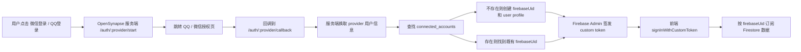

# OpenSynapse QQ / 微信登录与云同步设计

**项目**: OpenSynapse  
**日期**: 2026-03-28  
**适用范围**: Web 登录、Firebase 云同步、第三方账号绑定、后续多登录方式扩展

---

## 1. 目标

我们希望支持：

1. 用户使用 **QQ** 或 **微信** 登录 OpenSynapse
2. 登录后继续使用现有 **Firebase + Firestore** 云同步资产
3. 同一用户未来可以绑定多个登录方式，例如：
   - Google
   - 微信
   - QQ
4. 历史对话、笔记、闪卡始终归属于同一个 OpenSynapse 账号，而不是分散到不同登录方式下

一句话概括：

**第三方登录方式可以变，但用户资产不能散。**

---

## 2. 现状

当前项目已经有两层基础：

### 2.1 业务数据云同步

目前笔记、闪卡、会话数据都通过 Firebase Firestore 同步，相关入口：

- [src/firebase.ts](/Users/lv/Workspace/OpenSynapse/src/firebase.ts)
- [src/App.tsx](/Users/lv/Workspace/OpenSynapse/src/App.tsx)

### 2.2 当前登录方式

前端目前直接使用 Firebase Web Auth 的 Google popup 登录：

- [src/App.tsx](/Users/lv/Workspace/OpenSynapse/src/App.tsx)

这意味着：

- 当前账号系统建立在 `firebaseUid` 上
- Firestore 中所有业务数据都已经默认依赖 `firebaseUid`

所以：

**我们不缺业务云存储，缺的是把 QQ / 微信身份桥接进 Firebase 的认证层。**

---

## 3. 设计原则

QQ / 微信接入时，必须把下面三层拆开。

### 3.1 用户身份

回答“你是谁”。

例如：

- Google 登录
- 微信登录
- QQ 登录

这层最终都要归并到一个稳定的 `firebaseUid`。

### 3.2 Provider 凭证

回答“你拿什么访问外部服务”。

例如：

- QQ access token
- 微信 access token
- OpenAI API key
- Gemini Code Assist OAuth

这层不能和用户业务数据混在一起。

### 3.3 业务数据

回答“你的内容是什么”。

例如：

- 笔记
- 闪卡
- 历史对话
- 自定义人格
- 偏好设置

这层只认 `firebaseUid`，不应该直接认 QQ openid、微信 openid、某个 API key，或者某个 provider token。

---

## 4. 推荐总方案

推荐路线：

**QQ / 微信 OAuth -> OpenSynapse 服务端 -> Firebase Custom Token -> 前端 `signInWithCustomToken` -> Firestore 按 `firebaseUid` 同步**

这条路线最适合当前项目，因为：

1. 现有 Firestore 结构不用大改
2. 用户资产继续按 `firebaseUid` 归档
3. QQ / 微信只是“登录入口”，不是“主账号主键”
4. 后续可以继续支持 Google / QQ / 微信账号绑定

---

## 5. 为什么不用“直接让 Firebase 前端接 QQ / 微信”

对于当前项目，不建议优先赌“Firebase Web SDK 直接原生接 QQ / 微信”。

更稳妥的做法是：

- 由 OpenSynapse 自己的服务端完成 QQ / 微信 OAuth
- 服务端校验回调、换 token、取用户信息
- 最后由 Firebase Admin SDK 签发自定义登录令牌

原因：

1. 当前项目已经围绕 Firebase uid 建立了完整数据模型
2. QQ / 微信登录往往需要更灵活的回调、账号绑定和风控逻辑
3. 以后做“同一个用户绑定多个登录方式”时，自定义认证桥接更可控

---

## 6. 数据结构设计

推荐新增以下结构。

### 6.1 `users/{firebaseUid}`

用户主档案。

建议字段：

```ts
type UserProfile = {
  uid: string;
  displayName: string;
  avatarUrl?: string;
  primaryLoginProvider: 'google' | 'wechat' | 'qq';
  email?: string;
  createdAt: number;
  updatedAt: number;
  lastLoginAt: number;
  loginProviders: ('google' | 'wechat' | 'qq')[];
};
```

说明：

- 这张表只代表 OpenSynapse 自己的用户
- 所有业务数据最终都归这个 uid

### 6.2 `connected_accounts/{provider}_{providerUserId}`

第三方身份映射表。

建议字段：

```ts
type ConnectedAccount = {
  id: string; // e.g. wechat_oAbc123 / qq_9F0E11...
  provider: 'google' | 'wechat' | 'qq';
  providerUserId: string; // openid / sub
  unionId?: string; // 微信若能拿到，优先保留
  firebaseUid: string;
  displayName?: string;
  avatarUrl?: string;
  linkedAt: number;
  lastLoginAt: number;
  status: 'active' | 'revoked';
};
```

说明：

- Google / QQ / 微信都可以统一映射到这张表
- 同一用户未来可以有多条 `connected_accounts`
- 真正的账号主键仍然是 `firebaseUid`

### 6.3 `auth_sessions/{sessionId}` 或服务端 session store

短期登录态，可选。

如果后续要做：

- 登录后绑定新账号
- 回调状态追踪
- 防重放校验

建议保留一张短期会话表或 Redis/session store。

建议字段：

```ts
type AuthSession = {
  id: string;
  provider: 'wechat' | 'qq';
  state: string;
  nonce?: string;
  redirectTo?: string;
  action: 'login' | 'link';
  currentFirebaseUid?: string;
  createdAt: number;
  expiresAt: number;
  consumedAt?: number;
};
```

### 6.4 `account_secrets/{provider}_{providerUserId}`

只在需要长期持有 provider token 时使用。

建议字段：

```ts
type AccountSecret = {
  id: string;
  provider: 'wechat' | 'qq';
  providerUserId: string;
  encryptedAccessToken?: string;
  encryptedRefreshToken?: string;
  tokenExpiresAt?: number;
  scope?: string;
  updatedAt: number;
};
```

说明：

- 这类敏感数据不能直接暴露给前端
- 推荐只允许服务端访问
- 最好配合服务端加密

---

## 7. 一个关键选择：是否长期保存 QQ / 微信 token

这里分两种模式。

### 7.1 MVP 模式

目标：

- 用户只是“用 QQ / 微信登录 OpenSynapse”
- 登录完成后只需要一个稳定身份

此时推荐：

- **不长期保存 provider access token**
- 只保存身份映射：
  - provider
  - openid / unionid
  - firebaseUid

优点：

- 风险低
- 存储简单
- 安全边界更清晰

### 7.2 增强模式

目标：

- 后续还想代表用户调用 QQ / 微信开放能力
- 例如同步资料、头像更新、平台联动

此时推荐：

- 服务端长期保存 refresh token 或长期票据
- 使用 `account_secrets` 之类的 server-only 存储
- 对敏感字段做加密

对 OpenSynapse 当前目标而言：

**优先做 MVP 模式就够了。**

---

## 8. 登录流程

### 8.1 首次登录流程



### 8.2 已登录用户绑定新账号

例如：

- 当前用户已经用 Google 登录
- 想再绑定微信

流程应改为：

1. 当前用户已登录 OpenSynapse
2. 用户点击“绑定微信”
3. 服务端启动 `action=link`
4. 回调后服务端把该微信账号挂到当前 `firebaseUid`
5. 不创建新用户，不迁移数据

这样可以避免一个人产生多个账号。

---

## 9. 业务数据如何继续云同步

这部分当前逻辑基本不用改。

现在 Firestore 里的：

- `notes`
- `flashcards`
- `chat_sessions`

都已经通过 `userId == firebaseUid` 做过滤和订阅，见 [src/App.tsx](/Users/lv/Workspace/OpenSynapse/src/App.tsx)。

因此 QQ / 微信接入后，真正需要变化的只是：

- 登录完成后拿到一个 `firebaseUid`

后面的数据订阅和写入仍然沿用现有逻辑。

这也是我们坚持“把身份桥接到 Firebase uid”而不是“直接按 QQ / 微信 openid 存业务数据”的原因。

---

## 10. 需要新增的服务端接口

建议新增以下接口：

### 10.1 启动登录

- `GET /auth/wechat/start`
- `GET /auth/qq/start`

职责：

- 生成 `state`
- 写入短期 auth session
- 重定向到对应 provider 授权页

### 10.2 回调处理

- `GET /auth/wechat/callback`
- `GET /auth/qq/callback`

职责：

- 校验 `state`
- 用 `code` 换 provider 用户信息
- 查找或创建 `connected_accounts`
- 查找或创建 `users/{firebaseUid}`
- 用 Firebase Admin SDK 生成 custom token
- 返回给前端或重定向回前端页面

### 10.3 查询已绑定账号

- `GET /api/account/connected-providers`

职责：

- 返回当前 `firebaseUid` 已绑定哪些登录方式

### 10.4 解绑账号

- `POST /api/account/unlink-provider`

职责：

- 解绑某个 provider
- 但需要防止把最后一个登录入口也解绑掉

---

## 11. 前端需要改什么

### 11.1 登录页

当前只有 Google 登录按钮，见 [src/App.tsx](/Users/lv/Workspace/OpenSynapse/src/App.tsx)。

需要新增：

- `使用微信登录`
- `使用 QQ 登录`
- `继续使用 Google 登录`

推荐文案：

- Google 仍保留给国际环境和开发环境
- 微信 / QQ 作为中文用户主入口

### 11.2 账号设置页

建议新增“账号与绑定”区域：

- 当前登录身份
- 已绑定 provider 列表
- 绑定微信
- 绑定 QQ
- 解绑 Google / 微信 / QQ

### 11.3 登录完成方式

推荐两种实现：

1. 回调页里直接注入脚本，把 Firebase custom token 发给 opener
2. 回调页重定向到前端 `/auth/complete?token=...`

对当前项目而言，更稳的通常是：

- 服务端回调成功后，重定向前端到固定完成页
- 前端完成 `signInWithCustomToken`

---

## 12. Firestore 安全建议

### 12.1 业务数据

继续保持：

- 用户只能读写自己的 `notes / flashcards / chat_sessions`

### 12.2 账号映射

`connected_accounts` 建议：

- 普通客户端只读当前用户关联信息
- 创建和修改最好只由服务端完成

### 12.3 敏感凭证

`account_secrets` 建议：

- 完全禁止客户端读写
- 仅服务端 Admin SDK 访问

---

## 13. 安全边界

### 13.1 不要让前端直接保存 QQ / 微信长期凭证

前端可以拿短期 Firebase 登录态，但不要持有长期 provider refresh token。

### 13.2 必须使用 `state`

QQ / 微信授权都要使用并校验 `state`，避免 CSRF。

### 13.3 账号绑定时要校验“当前用户”

绑定新 provider 时，必须明确知道当前正在登录的 `firebaseUid`，防止把第三方账号绑错。

### 13.4 解绑要留后路

不能允许用户把最后一个登录方式解绑掉，否则账号会失去入口。

---

## 14. 推荐的 MVP 范围

为了降低复杂度，第一阶段建议只做：

1. 微信网站登录
2. QQ 网站登录
3. Firebase custom token 登录
4. `users`
5. `connected_accounts`
6. 账号绑定 / 解绑最小功能

第一阶段先不要做：

1. provider 长期 token 云端保存
2. 跨平台复杂联动
3. 微信公众号网页授权、小程序登录、PC 扫码登录同时并行
4. 多终端账号合并自动迁移

---

## 15. 推荐实施顺序

### Phase 1

完成认证桥接骨架：

- 服务端 `/auth/wechat/start`
- 服务端 `/auth/wechat/callback`
- Firebase custom token 签发
- 前端 `signInWithCustomToken`

### Phase 2

补齐 QQ 登录：

- `/auth/qq/start`
- `/auth/qq/callback`
- `connected_accounts` 映射

### Phase 3

补账号绑定中心：

- “已绑定的登录方式”
- 绑定 / 解绑
- 防止解绑最后一个 provider

### Phase 4

如果未来真的需要：

- 增加 `account_secrets`
- 服务端加密 provider token
- 支持更深的平台联动

---

## 16. 一句话结论

OpenSynapse 当前并不是“缺云存储”，而是：

**已经有 Firestore 业务云同步，但还缺一个把 QQ / 微信身份桥接到 Firebase uid 的认证层。**

正确做法不是让 QQ / 微信直接控制业务数据主键，而是：

- QQ / 微信只负责提供登录身份
- Firebase uid 继续作为账号主键
- 历史对话、笔记、闪卡继续按 `firebaseUid` 同步

这样未来就能做到：

- 用户换登录方式，资产不丢
- 一个账号绑定多个入口
- 业务数据结构保持稳定

---

## 17. 参考资料

- [Firebase custom auth](https://firebase.google.com/docs/auth/web/custom-auth)
- [Firebase OpenID Connect on web](https://firebase.google.com/docs/auth/web/openid-connect)
- [Firebase Auth provider configuration](https://firebase.google.com/docs/auth/configure-oauth-rest-api)

